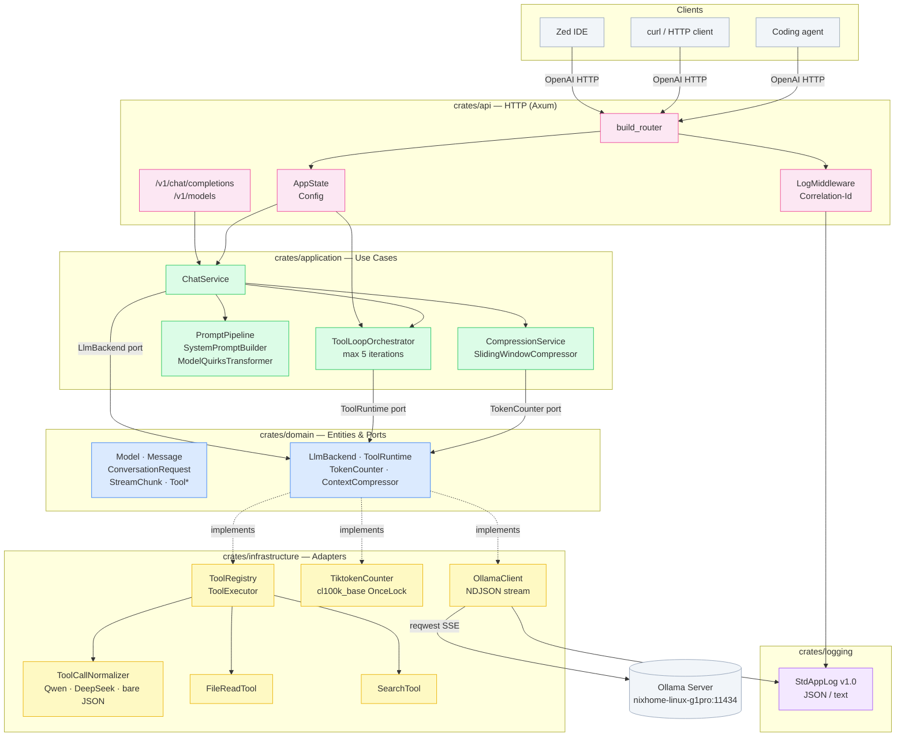

# nixacp-gateway

An OpenAI-compatible streaming gateway for local coding LLMs (Ollama / Qwen / DeepSeek), optimised for Zed IDE and coding-agent workflows. Built in Rust with Clean Architecture.

## Status

| Phase | Description | Status |
|-------|-------------|--------|
| 1 | Minimal streaming proxy | ✅ Done |
| 2 | Prompt pipeline + context compression | ✅ Done |
| 3 | Tool calls | ✅ Done |
| 4 | Reflection / retry + cancellation | ✅ Complete |
| 5 | ACP protocol / Zed agent integration | Planned |
| 6 | Observability + performance hot path | Planned |
| 7 | MCP + multi-backend + horizontal scale | Planned |

## Features

- **OpenAI-compatible API** — `/v1/chat/completions` (streaming SSE + non-streaming) and `/v1/models`
- **Ollama backend** — proxies to any remote or local Ollama instance
- **Prompt pipeline** — `SystemPromptBuilder`, `ModelQuirksTransformer`, and per-model prompt optimisation
- **Context compression** — sliding-window compressor keeps conversations within the model's token limit; pluggable strategy via trait
- **Tool calls** — full OpenAI function-calling round-trip; `ToolLoopOrchestrator` detects → dispatches → injects → resubmits (max 5 iterations); built-in `FileReadTool` and `SearchTool`
- **Tool-call normalisation** — translates between OpenAI format and model-native formats (Qwen2.5, DeepSeek, bare JSON)
- **Structured logging** — [Standard Application Log v1.0](https://github.com/preedep/standard-app-log/blob/main/README.md) with configurable JSON / text output
- **Layered config** — `gateway.toml` overridden by `GATEWAY_*` environment variables
- **Custom Tokio runtime** — physical-core worker threads, 512 KB stacks, 64 blocking threads

## Prerequisites

- Rust 1.86+ (MSRV)
- An [Ollama](https://ollama.com) instance with at least one model pulled

## Quick Start

```bash
# Clone
git clone https://github.com/preedep/nixacp-gateway.git
cd nixacp-gateway

# Edit gateway.toml — set your Ollama URL and model
# Then run
cargo run

# Test streaming
curl -N http://localhost:8080/v1/chat/completions \
  -H "Content-Type: application/json" \
  -d '{"model":"qwen2.5-coder:14b","messages":[{"role":"user","content":"say hello"}],"stream":true}'

# List models
curl http://localhost:8080/v1/models
```

## Configuration

All settings live in `gateway.toml`. Every key can be overridden with an environment variable prefixed `GATEWAY_` with `_` as the separator (e.g. `GATEWAY_SERVER_PORT=9090`).

```toml
[server]
host = "127.0.0.1"
port = 8080

[log]
format      = "json"           # "json" | "text"
level       = "info"           # tracing filter (e.g. "debug", "info,tower_http=warn")
app_id      = "nixacp-gateway"
app_version = "0.1.0"

[ollama]
url             = "http://localhost:11434"
default_model   = "qwen2.5-coder:14b"
max_concurrent  = 2            # Ollama GPU concurrency limit

[[ollama.models]]
name         = "qwen2.5-coder:14b"
display_name = "Qwen2.5 Coder 14B"
max_tokens   = 16384
```

For a local override that is never committed, copy to `gateway.local.toml` — it is in `.gitignore`.

## Zed IDE Integration

Point Zed's OpenAI-compatible provider at the gateway:

```json
// ~/.config/zed/settings.json
{
  "language_models": {
    "openai": {
      "api_url": "http://127.0.0.1:8080",
      "available_models": [
        { "name": "qwen2.5-coder:14b", "max_tokens": 16384 }
      ]
    }
  }
}
```

## Development

```bash
# Build
cargo build --workspace

# Run all tests (147 tests across all crates)
cargo test --workspace

# Run tests for a specific crate
cargo test -p domain          # 39 tests
cargo test -p application     # 33 tests
cargo test -p infrastructure  # 57 tests
cargo test -p api             # 14 tests

# Run a single test by name
cargo test -p application tool_loop::tests::single_tool_call_one_pass

# Run the tool-call integration tests only
cargo test -p api --test tool_calls

# Lint (CI enforces -D warnings — fix all before pushing)
cargo clippy --workspace --all-targets -- -D warnings

# Format (run before every commit)
cargo fmt --all

# Check without building
cargo check --workspace

# Plain-text logs (easier to read during development)
GATEWAY_LOG_FORMAT=text cargo run

# Verbose debug logs
GATEWAY_LOG_LEVEL=debug cargo run
```

## Architecture

Clean Architecture — dependencies flow inward only.



### Dependency rule

Arrows between crates go **inward only** — `api → application → domain ← infrastructure`. The domain layer has zero external I/O dependencies; infrastructure implements domain ports at the boundary.

```
nixacp-gateway (binary)
│
├── crates/api            HTTP server (Axum), SSE handler, OpenAI wire types
├── crates/application    ChatService, ToolLoopOrchestrator, CompressionService, PromptPipeline
├── crates/infrastructure OllamaClient, NDJSON parser, TiktokenCounter, ToolRegistry, ToolCallNormalizer
├── crates/domain         Entities, ports (LlmBackend, ToolRuntime, TokenCounter, ContextCompressor)
└── crates/logging        StdAppLog, log format config, subscriber init
```

See `CLAUDE.md` for the full architecture guide, coding conventions, performance rules, and testing strategy.

## Logging

All logs follow [Standard Application Log v1.0](https://github.com/preedep/standard-app-log/blob/main/README.md). Each line is a self-contained JSON object (or plain text when `format = "text"`).

| `log_type`    | Emitted when |
|---------------|--------------|
| `APP_LOG`     | Gateway start |
| `REQ_LOG`     | Inbound HTTP request received |
| `RES_LOG`     | HTTP response sent (includes `execution_time`) |
| `REQ_EX_LOG`  | Outgoing request to Ollama |
| `RES_EX_LOG`  | Response received from Ollama |

Example output:
```json
{"event_date_time":"2025-05-17T10:23:21.066Z","log_type":"REQ_LOG","app_id":"nixacp-gateway","level":"info","message":"POST /v1/chat/completions","request":{"id":"...","method":"POST","url":"/v1/chat/completions",...}}
{"event_date_time":"2025-05-17T10:23:21.378Z","log_type":"RES_EX_LOG","app_id":"nixacp-gateway","level":"info","execution_time":312,"message":"Ollama http://nixhome-linux-g1pro:11434/api/chat -> 200 (312ms)"}
{"event_date_time":"2025-05-17T10:23:21.379Z","log_type":"RES_LOG","app_id":"nixacp-gateway","level":"info","execution_time":313,"message":"POST /v1/chat/completions -> 200 (313ms)"}
```

## License

MIT
